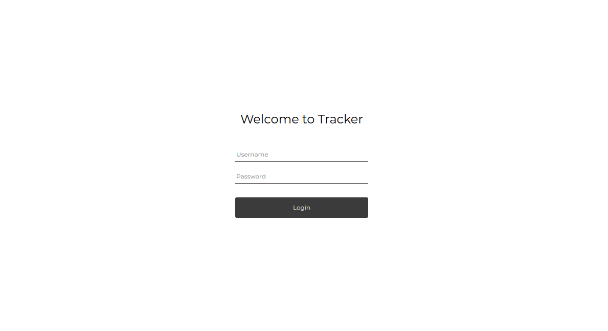
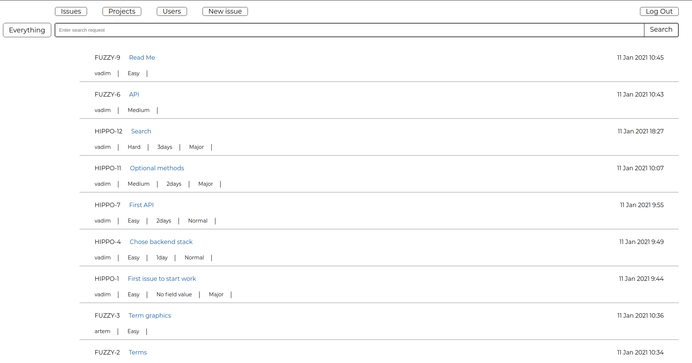
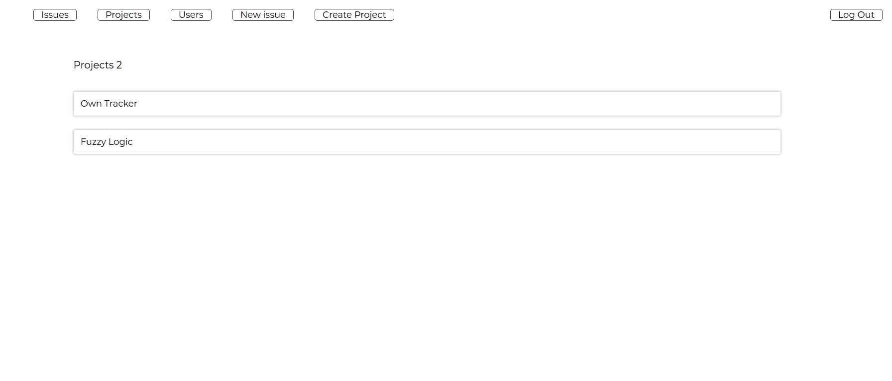

# What is it

This is issue-tracker that allows you to create and manage project, create users, create issues and rob caravans

# Screenshots





In `docs/images` you can find more images illustrating service work

# Main idea

It's full open-source project what you can use to manage you own projects with other users. 
It supports adding users, issues fields and search through them. 
You can create your project team to work together, leave comments and manage team.

Also, there in `fuzzy` folder laying project part with Fuzzy Logic, 
which(part) you can use in your python-based projects to calculate developer level. More about in [README](fuzzy/README.md)

# Dependencies

Project uses

* PHP 7.4
* Symfony 5.1
* Latest orm-pack at moment of creation
* Vue.js
* composer and yarn as package managers 

# How to run for development

* Create `.env.local` and set here empty variables from `.env`
* Go to `~dev`
  Most important variable is `ACCOUNT_DATABASE_URL`, it's an account database used to store all issues, projects etc.
* Run `docker-compose up -d` - it runs containers and in a main container install all dependencies(composer, yarn)
  and builds it. To find what run look at `~dev/Makefile`
* To boot full environment run. Need to do at first time, later when up project you can skip this step

````shell
 php bin/console app:boot -f
````

It migrates a database and creates default content if needed.
Default user is `root` with `12345Q` password

# How to run for production

Currently, production build is not supported. 
You can create your own production build, you just need to put all dependencies from Dockerfile and docker-compose.yaml 
from ~dev to your image, in `.env` write `APP_ENV=prod` and setup other env variables